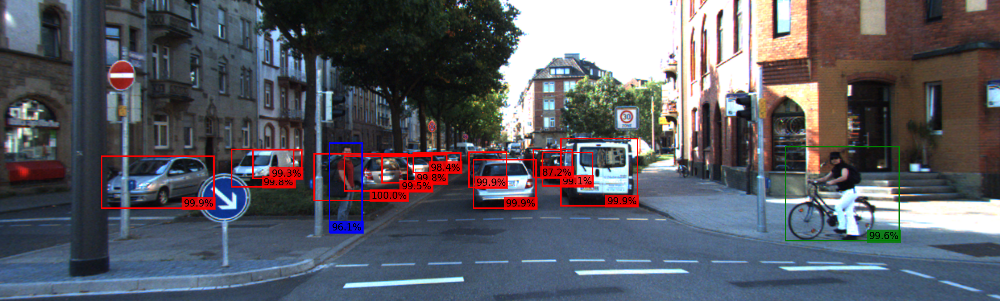

# AV Perception: Fine-Tuning Faster R-CNN on KITTI


Fine-tuned Faster R-CNN model with a ResNet-50-FPN backbone able to detect and classify pedestrians, cars, and cyclists within images based on
training data provided by KITTI dataset.



---
## Dataset

[KITTI Object Detection Benchmark](https://www.cvlibs.net/datasets/kitti/eval_object.php)

---

## Results

---
## Installation
1. **Clone the repository**  
    ```bash
    git clone https://github.com/beckarama/av-perception.git
    cd av-perception
    ```

2. **Create and activate a virtual environment**

   **Windows PowerShell:**
   ```shell
   py -m venv .venv
    .\.venv\Scripts\Activate.ps1
   ```
   
   **macOS/Linux:**

   ```shell
   python3 -m venv .venv
   source .venv/bin/activate
   ```
   
4. **Install dependencies**
   ```shell
    pip install -r requirements.txt
    ```
---

## Usage

### Run detection with pre-trained weights
Download `checkpoint_e10.pth` from (release link) into repo root, then in the notebook run the setup cells (model creation + 'detect' function),
load the checkpoint and call:
```python
model.load_state_dict(torch.load("checkpoint_e10.pth"))
detect("path/to/your/image.jpg")
```

### Train from scratch
Run the notebook from top to bottom. KITTI (~12 GB) downloads automatically on first run. Training uses 10 epochs over 7,000+ images with batches of 8. 


   
